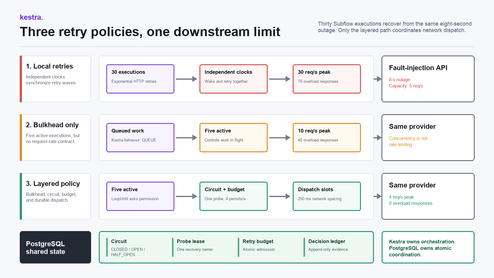
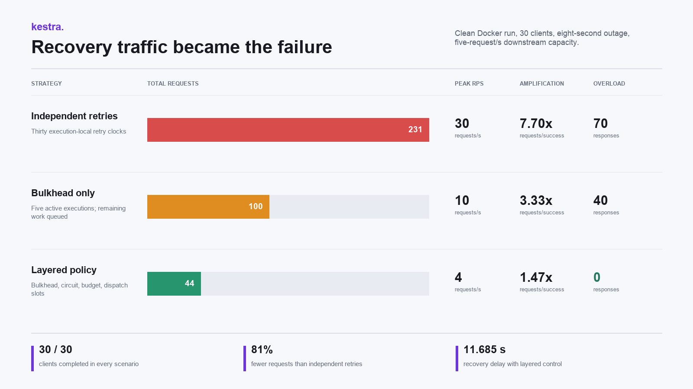

# The Retry Storm Was the Outage: Coordinating Retry Budgets in Kestra

## Thirty correct retry loops produced 231 requests for 30 successful calls. The fix required a bulkhead, a shared circuit, and durable dispatch pacing.

An eight-second downstream outage ended. The traffic did not.

Thirty Kestra executions were each running a reasonable exponential retry policy. Every execution eventually succeeded, but together they issued 231 requests for 30 successful operations. The recovery traffic peaked at 30 requests per second against a service that could accept five. After the scheduled outage cleared, the retries produced another 70 overload responses.

At that point the retry policy was the outage.

This article documents a controlled failure-injection lab, not a production incident. The point was to make retry amplification visible in Kestra, compare three policies under the same conditions, and package the result so another engineer can reproduce it rather than trust a diagram.

The final policy completed all 30 operations with 44 requests, held the peak to four requests per second, and produced zero overload responses. Getting there required one correction I did not expect: limiting permit issuance was insufficient because permits and actual network calls happened in different Kestra tasks.

## The Experiment Contract

I wanted a test small enough to run on a laptop and strict enough to expose coordination mistakes.

The lab launches 30 Kestra Subflow executions against one fault-injection API. The API has an eight-second scheduled outage and a post-recovery capacity of five requests per second. If traffic crosses that capacity, the API enters a 1.5-second overload cooldown. Every request, response reason, circuit decision, and client completion is persisted in PostgreSQL.

The three scenarios use the same client count, outage, capacity, cooldown, and provider latency:

1. Each execution retries independently with exponential backoff.
2. The same retry policy runs behind a flow concurrency limit of five.
3. A layered policy combines a five-execution bulkhead, a shared circuit breaker, four retry permits per second, and durable dispatch slots spaced 250 milliseconds apart.

The fourth permit rather than the fifth is deliberate. A retry budget should leave headroom for normal traffic and timing error. Spending the provider's entire advertised capacity on recovery is optimistic in a way that usually becomes educational at 3 AM.



The Docker package runs Kestra 1.3.21 with PostgreSQL repository and queue backends, PostgreSQL 16.14, and a Python 3.12.11 fault-injection API. The final clean run used an ARM64 Docker Engine 29.5.2 environment. Images are pinned by digest, and the mock API dependency is pinned by exact version.

The code blocks below are exact excerpts from the checked-in files, not invented stand-ins. The reproduction section runs the complete YAML, SQL functions, and Python adapter together.

## How the Lab Creates a Retry Storm

Each scenario has a parent flow and a client flow. The parent creates one durable scenario row, fans out 30 child executions with `ForEach`, waits for every `Subflow`, and collects metrics only after all children terminate. The client flow contains the retry policy being tested.

That split matters for the comparison. The parent workload is unchanged across scenarios. Only the client policy changes, so a lower request count cannot be explained by launching fewer clients or ending the run early. The complete parent flows are in the repository; the article concentrates on the policy code rather than printing the same 30 client values three times.

The mock provider is deliberately stateful. Before `outage_until`, every request returns `503 scheduled_outage`. After that timestamp, the provider accepts at most five requests in the same wall-clock second. The sixth request returns `503 capacity_exceeded` and starts a 1.5-second cooldown. Requests arriving during the cooldown return `503 overload_cooldown`.

That last rule matters. Without it, the provider would recover immediately at the next second boundary and the experiment would measure only a counter. The cooldown turns excess recovery traffic into additional unavailability, which is the behavior a retry storm creates in a saturated service.

The capacity decision and request event are written in the same PostgreSQL transaction:

```sql
if v_now < v_run.outage_until then
  v_status := 503;
  v_reason := 'scheduled_outage';
elsif v_run.overload_until is not null
      and v_now < v_run.overload_until then
  v_status := 503;
  v_reason := 'overload_cooldown';
else
  select count(*)
  into v_bucket_count
  from retry_lab.request_events
  where request_events.run_id = p_run_id
    and request_events.second_bucket = v_bucket;

  if v_bucket_count >= v_run.capacity_rps then
    update retry_lab.scenario_runs
    set overload_until =
      v_now
      + (v_run.overload_cooldown_ms * interval '1 millisecond')
    where scenario_runs.run_id = p_run_id;

    v_status := 503;
    v_reason := 'capacity_exceeded';
  else
    v_status := 200;
    v_reason := 'accepted';
  end if;
end if;
```

The scenario row is locked while this runs, so concurrent provider threads cannot each observe the same remaining capacity and all accept themselves. This makes the artificial limit deterministic enough to compare policies. It is not intended as a general-purpose rate limiter.

The provider also sleeps for 250 milliseconds after recording the decision. That gives each request non-zero service time and makes the distinction between concurrency and rate visible. A service can have five active callers and still receive more than five calls in one second.

## Strategy One: Every Execution Retries Correctly

The baseline client flow uses Kestra's HTTP Request task with exponential retries:

```yaml
- id: call_downstream
  type: io.kestra.plugin.core.http.Request
  uri: "http://mock-api:8080/work?run_id={{ inputs.run_id }}&client_id={{ inputs.client_id }}"
  method: GET
  timeout: PT5S
  retry:
    type: exponential
    interval: PT1S
    maxInterval: PT4S
    delayFactor: 2
    maxAttempts: 12
    maxDuration: PT2M
```

There is nothing obviously reckless in that task. A one-second initial delay, exponential growth, a four-second cap, and a bounded attempt count are normal choices for a transient 503.

The problem is scope. Each execution sees only its own failure and schedules only its own retry. Thirty identical executions begin together, fail together, and wake together. Exponential backoff changes the spacing between waves, but it does not coordinate the members of a wave.

This baseline intentionally does not add jitter. Jitter would spread some wake-ups and is useful, but it would not establish a shared downstream limit. Thirty independent clients can still exceed a five-request budget even when their retries are less synchronized. I wanted the first comparison to isolate the scope problem before adding probabilistic smoothing.

The clean baseline execution was `5bLjJFkgP7jbAvZzCxBMnv`. It completed all 30 clients, so a success-only dashboard would call it healthy. PostgreSQL recorded the less flattering version:

- 231 total requests
- 201 failed requests
- 30 requests per second at the peak
- 7.70 requests per successful client
- 70 responses caused by capacity exhaustion or overload cooldown
- 18.451 seconds from scheduled recovery until the final client completed

Local retries were correct in isolation and destructive in aggregate. That distinction is the core of the experiment.

## Strategy Two: A Bulkhead Is Not a Rate Limit

Kestra supports a flow-level `concurrency` property that limits how many executions of a flow may run at the same time. I added a five-execution bulkhead and queued the rest:

```yaml
concurrency:
  behavior: QUEUE
  limit: 5
```

This is useful. It reduced the clean run from 231 requests to 100 and lowered the peak from 30 to 10 requests per second. Retry amplification fell from 7.70 to 3.33.

It still produced 40 overload responses.

The reason is mechanical. Concurrency controls active executions, not request rate. Five executions can each finish an HTTP call in 250 milliseconds and collectively produce more than five requests in one second. They can also align their retries. A bulkhead limits how much work is in flight, but it does not define how quickly that work may cross an external boundary.

The official Kestra documentation describes concurrency as a global execution limit for a flow. That is the right abstraction. Treating it as an API rate limiter would assign it a contract it does not have.

The bounded execution `5lxH7qY7ADFEqDBXAygv1f` proved the useful middle ground: concurrency reduced the blast radius, but the downstream still needed coordinated recovery traffic.

## The Shared State Machine

The third strategy adds a PostgreSQL-backed coordinator. PostgreSQL is not replacing Kestra's orchestration. Kestra still owns the 30 child executions, loops, conditions, sleeps, HTTP tasks, and topology. PostgreSQL provides the atomic shared decision that independent executions cannot make safely in memory.

The circuit state is keyed by experiment run. The schema contains the circuit, the fixed-window admission counter, the probe lease, and the dispatch cursor in one row:

```sql
create table retry_lab.circuit_state (
  run_id text primary key,
  state text not null
    check (state in ('CLOSED', 'OPEN', 'HALF_OPEN')),
  consecutive_failures integer not null default 0,
  opened_at timestamptz,
  next_probe_at timestamptz,
  probe_owner text,
  probe_lease_until timestamptz,
  token_bucket timestamptz not null,
  tokens_used integer not null default 0,
  next_dispatch_at timestamptz not null,
  updated_at timestamptz not null default clock_timestamp()
);
```

`token_bucket` is an unfortunate column name left in the lab schema. It stores the beginning of the current one-second admission window; the implementation is a fixed-window counter, not a classical refillable token bucket. `tokens_used` records how many calls were admitted in that window. Smooth pacing comes later from `next_dispatch_at`.

The state contract is:

```text
state                 CLOSED | OPEN | HALF_OPEN
consecutive_failures  failure threshold input
next_probe_at         earliest permitted half-open probe
probe_owner           the one execution allowed to probe
probe_lease_until     recovery if the probe owner disappears
token_bucket          start of the fixed admission window
tokens_used           permits consumed in the current window
next_dispatch_at      durable network pacing cursor
```

Each client asks `acquire_permission()` before it calls the provider. The function locks the circuit row with `SELECT ... FOR UPDATE` and returns one of four decisions:

```text
CALL      circuit closed and retry budget available
PROBE     this execution owns the half-open probe lease
DEFER     circuit open, probe in flight, or budget exhausted
COMPLETE  this client already completed
```

The lock makes the permission decision atomic across all 30 executions. These two exact fragments from the function reset the window and implement the closed-circuit admission path:

```sql
select *
into v_circuit
from retry_lab.circuit_state
where circuit_state.run_id = p_run_id
for update;

if v_circuit.token_bucket < v_bucket then
  update retry_lab.circuit_state
  set
    token_bucket = v_bucket,
    tokens_used = 0,
    updated_at = v_now
  where circuit_state.run_id = p_run_id
  returning * into v_circuit;
end if;

update retry_lab.circuit_state
set
  tokens_used = tokens_used + 1,
  updated_at = v_now
where circuit_state.run_id = p_run_id
returning * into v_circuit;

v_action := 'CALL';
v_reason := 'closed_circuit_budget_granted';
```

The complete function in the repository also writes every decision to `decision_events`. That table made it possible to distinguish a call that failed from a call that was intentionally deferred. Without that distinction, the coordinated strategy would look slower in a task-count dashboard even though it sent far less network traffic.

The circuit opens after three failures. While open, clients do not call the provider. After three seconds, one client receives a probe lease. A successful probe closes the circuit; a failed probe reopens it. Late failures from calls that were already in flight are recorded, but they do not move `next_probe_at` and keep extending the outage.

That last condition came from a bug in the first version. Several calls had already received permission when the third failure opened the circuit. Their later 503 results repeatedly wrote another open transition and pushed the probe time forward. The state machine was technically serialized and still wrong. Row locking prevents races; it does not fix transition semantics.

The result transition therefore treats an in-flight failure received after the circuit has opened as evidence, but not as a new open event:

```sql
elsif v_circuit.state = 'OPEN' then
  v_action := 'RESULT_FAILURE';
  v_reason := 'in_flight_failure_after_open';
else
  update retry_lab.circuit_state as current_circuit
  set
    consecutive_failures =
      current_circuit.consecutive_failures + 1,
    state = case
      when current_circuit.consecutive_failures + 1 >= 3
        then 'OPEN'
      else current_circuit.state
    end,
    next_probe_at = case
      when current_circuit.consecutive_failures + 1 >= 3
        then v_now + interval '3 seconds'
      else current_circuit.next_probe_at
    end
  where current_circuit.run_id = p_run_id
  returning * into v_circuit;
end if;
```

The probe itself has a three-second lease. If its execution disappears, another client eventually observes the expired lease, returns the circuit to `OPEN`, and allows the probe election to run again. A circuit breaker without a lease can become a permanent outage when the half-open owner dies at the wrong moment.

## The Scheduling Gap Between a Permit and a Call

My first coordinated version granted at most four permits per second in PostgreSQL and then let a later Kestra HTTP task perform the call.

It looked correct in the code. It also passed one run.

The clean-volume rerun failed the claim. Under a different scheduler load, permitted executions waited in Kestra and several HTTP tasks became runnable together. The coordinator had limited permit time, not network time. The downstream peak reached nine requests per second and overload returned.

That was the most useful failure in the project because it exposed a boundary hidden by the YAML:

```text
SQL task grants permit
  -> Kestra schedules next task
  -> worker becomes available
  -> HTTP task actually sends request
```

Those timestamps are not interchangeable.

The final design keeps the admission budget and adds a durable dispatch cursor. Every coordinated call reserves a timestamp before the provider side effect:

```sql
select circuit_state.next_dispatch_at
into v_next_dispatch_at
from retry_lab.circuit_state
where circuit_state.run_id = p_run_id
for update;

v_dispatch_at := greatest(v_now, v_next_dispatch_at);

update retry_lab.circuit_state
set
  next_dispatch_at =
    v_dispatch_at
    + ((1000.0 / v_retry_budget_rps) * interval '1 millisecond'),
  updated_at = v_now
where circuit_state.run_id = p_run_id;
```

The provider adapter waits until that reserved slot before it records the downstream request. At four permits per second, slots are separated by 250 milliseconds. If Kestra releases several HTTP tasks together, they reserve different dispatch times and leave the adapter at a controlled pace.

This is the difference between admission and dispatch:

```text
admission budget
  decides whether this execution may make another attempt

dispatch cursor
  decides when the permitted attempt may cross the network boundary
```

A fixed-window budget alone can legally grant four permits near the end of one second and four more at the beginning of the next. That is eight permits across a narrow boundary. The dispatch cursor serializes those grants onto timestamps 250 milliseconds apart, so scheduler delay cannot turn them into one burst.

This is not an excuse to hide orchestration inside an HTTP service. Kestra still decides whether the call is allowed, whether an execution owns the probe, whether it should defer, and when the client is complete. The adapter enforces the final timing at the boundary where timing becomes real.

In another architecture, that pacing layer could be an API gateway, a queue consumer, or a dedicated rate-limiting proxy. The important property is that admission and dispatch cannot drift apart without a second control.

## The Kestra Recovery Loop

The coordinated child flow uses `LoopUntil` to make the state machine visible:

```yaml
- id: coordinate_recovery
  type: io.kestra.plugin.core.flow.LoopUntil
  condition: "{{ outputs.check_completion.row.completed == true }}"
  failOnMaxReached: true
  checkFrequency:
    interval: PT0.1S
    maxDuration: PT3M
    maxIterations: 360
  tasks:
    - id: acquire_permission
      type: io.kestra.plugin.jdbc.postgresql.Query
      fetchType: FETCH_ONE
      sql: |
        select *
        from retry_lab.acquire_permission(
          '{{ inputs.run_id }}',
          '{{ inputs.client_id }}'
        );

    - id: route_permission
      type: io.kestra.plugin.core.flow.If
      condition: >-
        {{
          outputs.acquire_permission.row.action == 'CALL'
          or outputs.acquire_permission.row.action == 'PROBE'
        }}
      then:
        - id: call_downstream
          type: io.kestra.plugin.core.http.Request
          uri: "http://mock-api:8080/coordinated-work?run_id={{ inputs.run_id }}&client_id={{ inputs.client_id }}"
          options:
            allowFailed: true

        - id: record_result
          type: io.kestra.plugin.jdbc.postgresql.Query
          fetchType: FETCH_ONE
          sql: |
            select *
            from retry_lab.record_result(
              '{{ inputs.run_id }}',
              '{{ inputs.client_id }}',
              {{ outputs.call_downstream.code }}
            );
      else:
        - id: defer_attempt
          type: io.kestra.plugin.core.flow.Sleep
          duration: PT0.4S
```

The flow does not use the HTTP task's automatic retry policy. A 503 is data for the coordinator, so `allowFailed: true` keeps the task successful and passes the response code into `record_result()`. The loop decides what happens next.

There are two bounded waits. `LoopUntil` has a three-minute maximum and 360-iteration ceiling. A probe owner has a three-second lease, so a dead execution cannot leave the circuit stuck in `HALF_OPEN`. These are separate failure domains and need separate limits.

The `DEFER` branch sleeps for 400 milliseconds before checking again. The SQL function also returns a more precise `wait_ms`, but this lab keeps the Kestra delay fixed so the YAML remains easy to inspect. A production implementation should use the returned deadline or an event-driven wake-up rather than polling every coordinator row at the same interval.

## How the Measurements Are Calculated

All reported numbers come from PostgreSQL, not from parsing Kestra logs. The provider writes one row per actual request to `request_events`; the coordinator writes one row per decision to `decision_events`; and each client has a durable completion record.

The metrics function calculates peak traffic by grouping actual provider requests into one-second buckets:

```sql
select coalesce(max(bucket_count), 0)
from (
  select count(*) as bucket_count
  from retry_lab.request_events
  where request_events.run_id = p_run_id
  group by second_bucket
) per_second;
```

The terms in the result image mean:

```text
total requests
  every call that reached the mock provider

failed requests
  provider responses with status >= 400

peak RPS
  maximum request count in any wall-clock second

requests per success
  total provider requests / 30 expected clients

overload responses
  capacity_exceeded + overload_cooldown

recovery delay
  final client completion time - scheduled outage end
```

Requests per success is called retry amplification in the result artifact. It is a deliberately simple workload ratio, not a universal retry-amplification formula. Every scenario had exactly 30 successful clients, so the ratio is comparable inside this experiment.

Recovery delay starts when the scheduled eight-second outage ends, not when the scenario starts. That prevents the configured outage duration from making every policy look equally slow.

## Measured Results



**Independent retries:** 231 requests, 201 failed requests, 30 peak requests per second, 7.70 requests per success, 70 overload responses, and 18.451 seconds of recovery delay.

**Five-execution bulkhead:** 100 requests, 70 failed requests, 10 peak requests per second, 3.33 requests per success, 40 overload responses, and 16.974 seconds of recovery delay.

**Bulkhead, circuit, budget, and pacing:** 44 requests, 14 failed requests, 4 peak requests per second, 1.47 requests per success, zero overload responses, and 11.685 seconds of recovery delay.

All three strategies completed all 30 clients. The difference was how much additional failure they generated while doing it.

The final execution was `2plUaoV3Ds5hiykILUsghw`. It opened or reopened the circuit twice, granted two half-open probes, and recorded 45 deferred attempts. Deferral was not failure. It was the mechanism that prevented 45 attempts from becoming immediate network traffic.

The other clean execution IDs were `5bLjJFkgP7jbAvZzCxBMnv` for independent retries and `5lxH7qY7ADFEqDBXAygv1f` for the five-execution bulkhead. The checked-in `results/experiment-results.json` and `results/summary.csv` contain the same IDs and values.

Compared with independent retries, the layered policy reduced total requests by about 81 percent and eliminated overload responses in the clean run. I would not generalize that percentage beyond this experiment. The useful result is the shape: local backoff amplified synchronized work, the bulkhead reduced but did not regulate it, and shared admission plus dispatch pacing kept recovery below downstream capacity.

The goal was not to make the recovery path as fast as possible. It was to complete recovery without creating another outage. The layered run reserved one request per second of provider headroom and still finished sooner than either uncoordinated policy because it did not keep pushing the provider back into cooldown.

The intermediate failed design is also preserved as `results/development-dispatch-gap.json`. Its execution `1oXfqxEQufF6MFGmKBGYEC` completed all clients but peaked at nine requests per second and generated 25 overload responses. Keeping a failed result in the repository is less tidy than deleting it, but it documents why the dispatch cursor exists.

## Reproduce It

The complete repository is available at [github.com/arjunarav/kestra-retry-storm-lab](https://github.com/arjunarav/kestra-retry-storm-lab).

Start the pinned stack and run all three scenarios:

```bash
git clone https://github.com/arjunarav/kestra-retry-storm-lab.git
cd kestra-retry-storm-lab
cp .env.example .env
docker compose up -d --build
python3 -u scripts/run_experiment.py
```

Kestra is available at `http://127.0.0.1:8082` with the local credentials `admin@kestra.io` and `Admin1234`. The runner imports all six flows, executes the scenarios sequentially, waits for terminal states, and writes `results/latest-run.json`.

For the final validation I removed the lab volumes before rebuilding:

```bash
docker compose down --volumes --remove-orphans
docker compose up -d --build
python3 -u scripts/run_experiment.py
```

That matters because a successful rerun against old database state would not prove that the schema, flow import, and initialization path were complete. The clean-volume run recreated PostgreSQL, started Kestra with PostgreSQL repository and queue backends, imported all six checked-in flows, and completed the three parent executions.

Exact counts vary slightly with local scheduling. The assertions that matter are structural: 30 completed clients in each run, overload in the first two strategies, zero overload in the layered strategy, and lower retry amplification after coordination.

The runner fails if a parent execution ends outside `SUCCESS` or `WARNING`. After each successful parent, it reads the flow output produced by `retry_lab.metrics()` and writes the execution ID, run ID, state, duration, and metrics to JSON.

The repository also includes SQL queries for inspecting per-second traffic and the append-only decision ledger:

```bash
docker compose exec -T postgres \
  psql -U kestra -d kestra -c \
  "select * from retry_lab.metrics('YOUR_RUN_ID');"
```

```sql
select
  second_bucket,
  count(*) as requests,
  count(*) filter (where response_status = 200) as successful,
  count(*) filter (where response_status >= 400) as failed,
  count(*) filter (
    where reason in ('capacity_exceeded', 'overload_cooldown')
  ) as overload
from retry_lab.request_events
where run_id = 'YOUR_RUN_ID'
group by second_bucket
order by second_bucket;
```

## Where This Design Stops

This is a production-shaped failure-injection package, not a drop-in production retry service.

The coordinator row is scoped to one experiment run. In a real system I would key the state by downstream dependency, tenant, and possibly operation class. A single row for every dependency would serialize unrelated traffic and eventually become the bottleneck it was meant to protect.

PostgreSQL is a useful coordinator here because `SELECT ... FOR UPDATE` gives the permission path a clear linearization point. It also means coordinator availability depends on the database. Production behavior must define what happens when the database is slow or unavailable: fail closed, use a degraded local budget, or route through a separate admission service. Silently falling back to unrestricted retries would be the worst option.

The fixed-window budget is intentionally simple. A production limiter may need a real token bucket, sliding window, weighted permits, tenant fairness, adaptive capacity, or separate budgets for first attempts and retries. First attempts are usually more valuable than retries; making them compete in one undifferentiated bucket can punish healthy traffic.

The provider adapter enforces `next_dispatch_at` by waiting before the call. That proves the timing boundary, but tying up request-handler threads is not the architecture I would use at high throughput. A queue consumer, gateway, or dedicated rate-limiting proxy can own scheduled dispatch without holding one thread per future slot.

Finally, none of these controls makes a non-idempotent side effect safe. A retry budget limits volume. It does not answer whether a timed-out request committed. External writes still need idempotency keys or a query-and-reconcile path before repetition.

## What I Would Carry Into Production

I would start by treating every retry as load, not as a harmless control-flow feature. Backoff belongs at the execution level, but a shared dependency also needs a shared budget. The budget should reserve headroom instead of consuming the provider's full limit.

I would keep the bulkhead even after adding a circuit breaker. They solve different problems. The bulkhead limits work in flight, the circuit stops calls during a known outage, the retry budget controls admission, and dispatch pacing handles scheduler jitter at the network boundary.

I would partition coordinator rows by dependency and tenant rather than force unrelated traffic through one hot lock. PostgreSQL row locks made this lab easy to reason about, but a single global row would become its own bottleneck. Production code also needs lock timeouts, statement timeouts, coordinator metrics, retention for the decision ledger, and failover tests.

I would still require provider idempotency. A retry budget controls volume; it does not make side effects safe. The checkout-saga lesson still applies: a timeout can mean unknown state, and the recovery path must query evidence before repeating a non-idempotent action.

Most importantly, I would measure the time of the actual external call. The first coordinated implementation measured permit issuance and assumed the network would follow immediately. The clean rerun removed that assumption for me.

Before I add a retry now, I ask two questions: who else will retry at the same time, and where is the final dispatch rate enforced?

## References

- [Kestra flow concurrency documentation](https://kestra.io/docs/workflow-components/concurrency)
- [Kestra task retries documentation](https://kestra.io/docs/workflow-components/retries)
- [Kestra HTTP Request task](https://kestra.io/plugins/core/http/io.kestra.plugin.core.http.request)
- [Kestra LoopUntil task](https://kestra.io/plugins/core/flow/io.kestra.plugin.core.flow.loopuntil)
- [Kestra PostgreSQL Docker Compose example](https://kestra.io/docs/installation/docker-compose)
- [PostgreSQL explicit locking](https://www.postgresql.org/docs/16/explicit-locking.html)
- [AWS Builders' Library: Timeouts, retries, and backoff with jitter](https://aws.amazon.com/builders-library/timeouts-retries-and-backoff-with-jitter/)

## Author Note

I built and ran this lab locally in Docker, reset its volumes, and reran the complete package from the checked-in files before writing the final results. The repository includes the Kestra YAML, PostgreSQL functions, mock provider, execution runner, and measured output used in this article. I used AI assistance during drafting and implementation, then reviewed, debugged, reran, and finalized the work myself.
